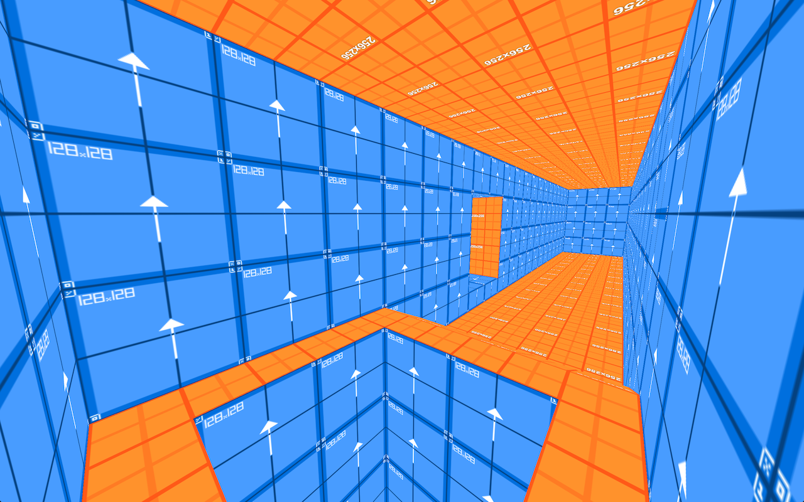
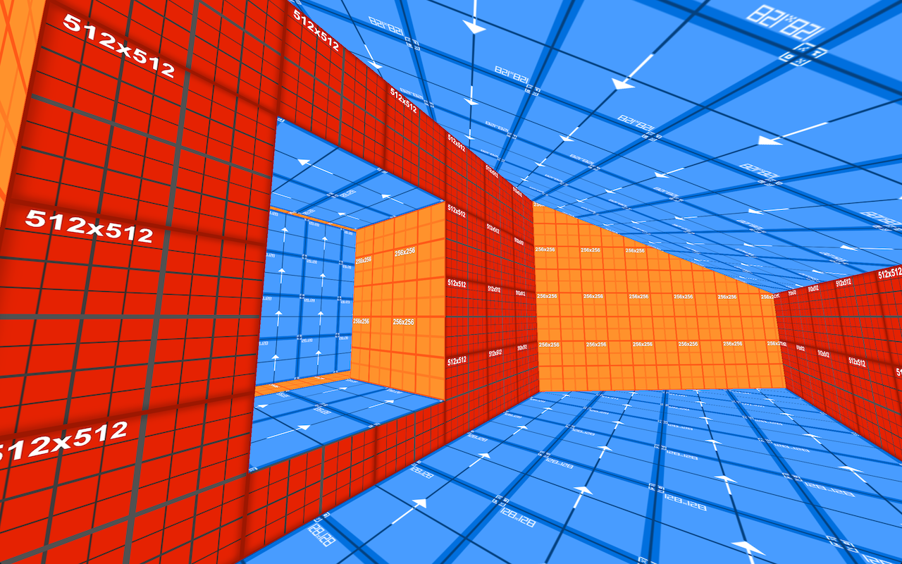

# SectorEdit
SectorEdit is a first person 3D graphics engine I started working on in high school to learn about 3D rendering techniques. My goal was to do as much of the rendering / math on my own with minialmal use of libraries. It uses Optimizations from older game engines like Quake and Goldsource and works in OpenGL immediate mode with the fixed function pipeline. Theoretically, there is no overdraw (meaning each pixel is only rendered once, eliminating the need for the z-buffer). It is functional, but far from a finished product.

# Videos
[This video](https://youtu.be/1-gUqjgtVU8) is a demonstration of walking around a test level.

[This video](https://youtu.be/O8af9gzHoMU) is a demonstration of how level geometry is subdivided in real-time to eliminate overdraw. Notice how additional subdivions appear when a wall is partially occluded by level geometry, and the edges of triangles are never occluded.

# Screen Shots

## Bugs
It is buggy. I dont have infinite time, and I have more important things to do.

## Dependencies
* GO-GL 2.1
* GLFW 3.2
